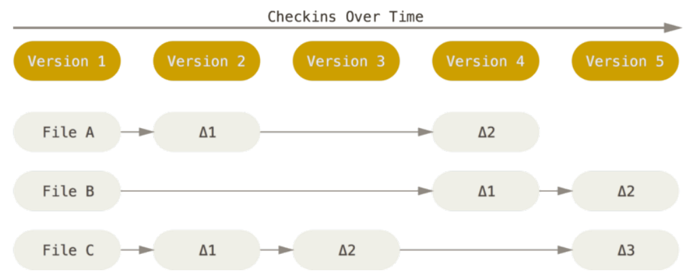
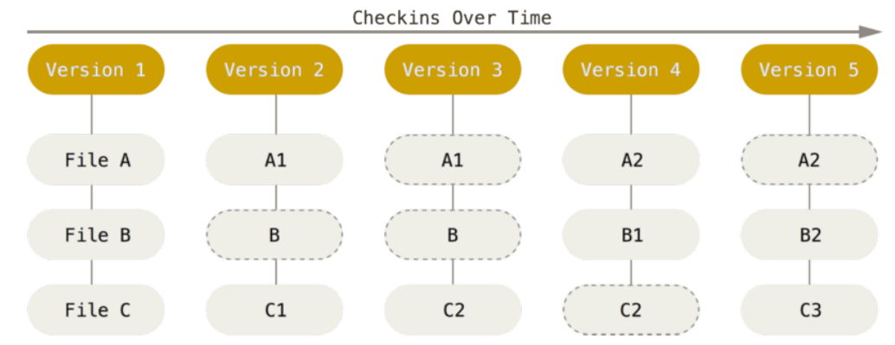

Getting Started
==
###### [Index](../index.md) / Getting Started / 1-2 Snapshots, Not Differences

## 1-2 Snapshots, Not Differences
The major difference between Git and any other VCS (Subversion and friends included) is the way Git thinks about its data. Conceptually, most other systems store information as a list of file-based changes. These other systems (CVS, Subversion, Perforce, Bazaar, and so on) think of the information they store as a set of files and the changes made to each file over time (this iscommonly described as delta-based version control).

Git doesn’t think of or store its data this way. Instead, Git thinks of its data more like a series of snapshots of a miniature filesystem. With Git, every time you commit, or save the state of your project, Git basically takes a picture of what all your files look like at that moment and stores a reference to that snapshot. To be efficient, if files have not changed, Git doesn’t store the file again, just a link to the previous identical file it has already stored. Git thinks about its data more like a stream of snapshots.

This is an important distinction between Git and nearly all other VCSs. It makes Git reconsider almost every aspect of version control that most other systems copied from the previous generation. This makes Git more like a mini filesystem with some incredibly powerful tools built on top of it, rather than simply a VCS. We’ll explore some of the benefits you gain by thinking of your data this way when we cover Git branching in Git Branching.

[...Prev Page](1-1-0.md) <--------------> [Next Page...](1-3-0.md)